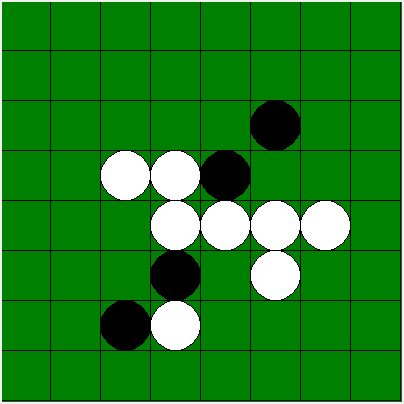

# Othello Game and AI

#### Pure Python Environment
No dependencies, no compiling, run main.py

#### User Note:
1. AI/OthelloAI.py is a template of AI
    * Your AI should implement __init__ and getAction methods
    * Your AI should able to be imported to main.py
    * No other rules

2. Write your script to run/test AIs in main.py
    * Specify two players (white and black) in main.py
    * Script in main.py to specify how many matches and other details

#### Project Structure
    /AI/Base/
    * contains all the helpers (optional) for AI
    
    /AI/
    * contains all AI
    
    /History/
    * outdated files archived
    
    /resources/
    * pictures and other files
    
    
    /main.py
    * entry point, specify game by editing this file
    
    /OthelloGUI.py
    * GUI using Pygame
    
    /OthelloLogic.py
    * Othello game logic part